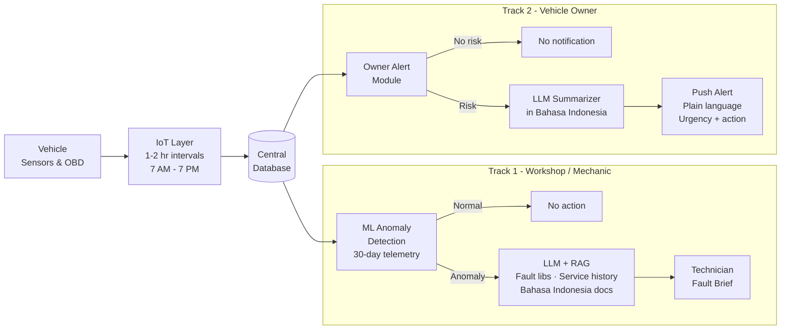

# LLM-Powered Predictive Fault Detection for Automotive Safety

## Problem Framing & Business Relevance

---

## Punchline

> **"Most vehicles don't break down from bad parts — they break down because no one saw it coming."**

The sensors are already there. The fault history is already there. The gap is a system that connects them into an early warning — before a breakdown, before a safety incident, before the driver is stranded on the road.

---

## The Problem

Every year, millions of road incidents and unplanned breakdowns occur not from sudden mechanical failure — but from gradual, detectable degradation that went unnoticed. OBD systems log fault codes. Sensors capture temperature, pressure, RPM variance, and battery voltage continuously. Yet most vehicle owners and even workshop technicians only see this data _after_ something has already failed.

The result:

- Breakdowns that strand drivers mid-journey — often in unsafe conditions
- Safety incidents caused by brake, tire, and engine faults that were building for weeks
- Repair bills that are 3–5× higher because degradation was caught too late
- Workshop technicians spending 20+ minutes diagnosing what a connected system could flag in seconds

This is not a data problem. It is an interpretation problem — and it is exactly what large language models, combined with anomaly detection, are built to solve.

---

## Global Context

### Road Safety & Vehicle Breakdown — The Scale

| Statistic                                              | Value                                 | Source                        |
| ------------------------------------------------------ | ------------------------------------- | ----------------------------- |
| Global road traffic deaths annually                    | ~1.19 million                         | WHO, 2023                     |
| Breakdowns attributed to preventable mechanical faults | ~65%                                  | RAC / AA UK breakdown studies |
| Average repair cost — reactive vs. preventive          | 3–5× higher when reactive             | Deloitte Automotive, 2022     |
| Predictive maintenance cost savings                    | 18–25% reduction in maintenance costs | McKinsey via Infraspeak, 2018 |
| Global automotive predictive maintenance market (2024) | ~$28B, growing at 26% CAGR            | MarketsandMarkets, 2024       |

### Why Existing Solutions Fall Short

Most OBD-based tools (dongles, basic apps) do one thing: show a fault code when a warning light is already on. By that point, the fault has already occurred. They cannot:

- Detect multi-signal degradation patterns _before_ any single threshold is crossed
- Reason over a vehicle's maintenance history to assess cumulative risk
- Explain what a fault means in plain language a driver or technician can act on
- Predict _when_ — not just _whether_ — a component is likely to fail

---

## Indonesia Focus (Primary Market)

### Why Indonesia Is a Critical Deployment Context

Indonesia is one of the fastest-growing vehicle markets in Southeast Asia — and one of the most underserved in terms of vehicle health monitoring infrastructure. Road safety and vehicle reliability are acute challenges at both the private and commercial vehicle level.

| Statistic                                                | Value                                    | Source                        |
| -------------------------------------------------------- | ---------------------------------------- | ----------------------------- |
| Registered vehicles in Indonesia (2023)                  | 148+ million                             | BPS / Korlantas Polri, 2023   |
| Annual road traffic fatalities                           | ~27,000+                                 | WHO / Korlantas, 2023         |
| Percentage of workshops using digital diagnostic tools   | Low — majority still manual              | GAIKINDO / industry estimates |
| Vehicle breakdown as a road accident contributing factor | Significant — exact % varies by corridor | Kementerian Perhubungan, 2023 |
| Automotive aftermarket size — Indonesia (2024)           | ~$8B+, growing                           | Frost & Sullivan ASEAN, 2024  |

The majority of Indonesian vehicle owners — private cars and commercial fleets alike — have no access to continuous vehicle health monitoring. Fault detection happens reactively: the warning light comes on, the vehicle breaks down, or the driver notices something feels wrong. By any of these points, the window for low-cost intervention has already closed.

---

## Problem Statement

### Who

Private vehicle owners, fleet operators, and workshop technicians in Indonesia — anyone responsible for keeping a vehicle roadworthy and safe.

### What

Vehicles accumulate detectable fault signals — in OBD telemetry, sensor patterns, and service history — days or weeks before a breakdown or safety incident occurs. No affordable, accessible system currently connects these signals into an early warning that a non-technical owner can understand and act on. The gap costs lives, strands drivers, and turns manageable maintenance into emergency repairs.

### The Two Moments This System Closes

**For the driver / vehicle owner:**
The vehicle's IoT or OBD system collects sensor readings throughout the day — every 1–2 hours between 7 AM and 7 PM, generating up to 12 data points per day. These are pushed to a database as tabular reports. The system processes this accumulating data and sends the owner a plain-language alert when patterns suggest risk: what is trending abnormal, what it could mean, and how urgently to act. No raw sensor values. No fault codes. Just a clear, safety-relevant notification in language they understand.

**For the workshop technician:**
When a vehicle arrives for service or inspection, the technician has the last 30 days of sensor telemetry available. An ML model classifies which signal patterns are anomalous. The findings are passed to an LLM pre-loaded with fault code libraries, known failure signatures, and the vehicle's service history. The output is a plain-language fault brief — exactly what to inspect, why, and what the likely fault is — before the technician lifts the hood.

### Why AI Is the Right Answer

Fault prediction requires connecting heterogeneous, unstructured signals that no rule-based system handles well:

- OBD codes are cryptic and only fire after a threshold is already crossed
- Sensor data requires cross-signal pattern analysis, not single-metric thresholds
- Maintenance records in Indonesia are informal, handwritten, or stored inconsistently
- The interpretation needs to reach a non-technical vehicle owner in plain language

An LLM with a Retrieval-Augmented Generation (RAG) pipeline handles all of this — grounding every prediction in the vehicle's own data and documentation, with zero hallucination on safety-critical outputs.

---

## System Architecture (High Level)

```
VEHICLE SENSORS / OBD
        │
        ▼
IoT Layer — readings every 1–2 hours, 7 AM to 7 PM
(up to 12 data points per day)
        │
        ▼
Tabular Report → Central Database
        │
        ├─────────────────────────────────────────┐
        ▼                                         ▼
ML Anomaly Detection Model                OWNER ALERT MODULE
(Last 30 days of sensor telemetry)        (Daily health summary)
        │                                         │
[Normal] → No action             [Risk Detected] → Push notification
        │                         "Brake pad wear trending critical.
[Anomaly Detected]                 Service recommended within 7 days."
        │
        ▼
LLM + RAG Pipeline
(Fault code library, service history,
 known failure signatures)
        │
        ▼
Plain-language fault brief → Workshop Technician
"Sensor tekanan oli menunjukkan penurunan
 bertahap selama 18 hari terakhir. Kemungkinan
 kebocoran pada gasket atau pompa oli.
 Periksa sebelum kendaraan diberangkatkan."
```

---

## Objectives

1. **Build a data ingestion pipeline** that processes vehicle IoT/OBD sensor readings on a 1–2 hour interval (7 AM–7 PM), stores tabular daily reports to a database, and makes them queryable by both the owner alert module and the anomaly detection model.

2. **Deploy an ML anomaly detection model** trained on 30 days of vehicle telemetry per vehicle — classifying signal patterns as normal or anomalous across multi-signal combinations, not just single-metric thresholds.

3. **Build a RAG pipeline** ingesting OBD-II fault code libraries, known failure signature documents, and the vehicle's own service history — grounding every LLM output in retrieved evidence, not generated assumptions.

4. **Deliver owner-facing predictive safety alerts** — plain language, mobile-push format, summarizing daily vehicle health and flagging risk with urgency level and recommended action.

5. **Deliver technician-facing fault briefs** at the point of workshop inspection — citing retrieved source records, written in Bahasa Indonesia, with zero hallucination on safety-critical content.

6. **Instrument operational metrics** — anomaly detection accuracy, retrieval relevance score, alert precision rate, and response latency — visible live during demo.

7. **Ship reproducible, credential-free code on GitHub** with a full README covering setup, data format, and run steps.

---

## Target Users

### Vehicle Owner (Private)

Receives a daily summary of their car's health status based on IoT readings collected throughout the day. When the model detects a risk pattern, receives a push alert — in plain language, with a clear urgency level and recommended action. Never sees raw sensor data or OBD codes. Knows what to do and when.

### Fleet Manager / Operator

Gets a risk-ranked view across all vehicles — which are most likely to develop a fault this week, what the safety implication is, and what action to take. Reduces breakdown incidents that affect driver safety, route reliability, and vehicle availability.

### Workshop Technician (Mechanic)

Receives a pre-inspection fault brief before the vehicle arrives — based on 30 days of telemetry and cross-referenced against fault libraries and service history. Knows exactly what to inspect and why. Spends limited inspection time on the right problem, not on diagnosis from scratch.

---

## Business Relevance

### The Market Opportunity

| Segment                      | Opportunity                                                                                            |
| ---------------------------- | ------------------------------------------------------------------------------------------------------ |
| Private vehicle owners       | 148M+ registered vehicles in Indonesia alone — nearly zero penetration of predictive health monitoring |
| Automotive workshops         | Efficiency gain from pre-diagnosis reduces inspection time and increases throughput per bay            |
| Fleet operators              | Reduced breakdown incidents → lower insurance claims, fewer SLA penalties, safer drivers               |
| OEM / automotive aftermarket | Embeddable as a connected vehicle service or aftermarket OBD dongle product                            |

### Revenue Model

- **SaaS subscription** — per vehicle per month, tiered by vehicle count (individual, SME fleet, enterprise fleet)
- **Workshop SaaS tier** — subscription per workshop bay, providing technician-facing fault brief tooling
- **OEM / white-label licensing** — embedded as a branded connected vehicle safety feature
- **Hardware bundle** — optional OBD dongle + subscription for vehicles without native IoT capability

### Competitive Differentiation

| Capability                                     | Standard OBD Apps | Rule-Based Fleet Tools | This System |
| ---------------------------------------------- | ----------------- | ---------------------- | ----------- |
| Detects faults before warning light            | ✗                 | Partial                | ✓           |
| Multi-signal anomaly detection                 | ✗                 | ✗                      | ✓           |
| Plain-language explanation (not codes)         | ✗                 | ✗                      | ✓           |
| Bahasa Indonesia output                        | ✗                 | ✗                      | ✓           |
| Grounded in vehicle's own service history      | ✗                 | ✗                      | ✓           |
| Owner alert + technician brief in one pipeline | ✗                 | ✗                      | ✓           |

---

## Government & Regulatory Alignment

Indonesia's national road safety agenda — under the Kementerian Perhubungan and aligned with the UN Decade of Action for Road Safety 2021–2030 — explicitly targets reduction in road fatalities and improved vehicle roadworthiness standards. The Bappenas national logistics strategy also targets reduction of land transport costs from 14.3% to 8% of GDP by 2045, with vehicle reliability named as a lever.

This system directly contributes to both by reducing the frequency of safety-critical breakdowns, improving the quality of preventive maintenance, and making vehicle health monitoring accessible to vehicle owners who currently have none.

---

## Citations & References

| #   | Source                                                             | URL                                                                                       |
| --- | ------------------------------------------------------------------ | ----------------------------------------------------------------------------------------- |
| 1   | WHO — Global road safety report, 2023                              | https://www.who.int/publications/i/item/9789240086517                                     |
| 2   | McKinsey via Infraspeak — Predictive maintenance cost savings      | https://blog.infraspeak.com/predictive-maintenance-cost-effective/                        |
| 3   | MarketsandMarkets — Automotive predictive maintenance market, 2024 | https://www.marketsandmarkets.com/Market-Reports/automotive-predictive-maintenance-market |
| 4   | BPS / Korlantas Polri — Registered vehicles Indonesia, 2023        | https://www.bps.go.id                                                                     |
| 5   | Frost & Sullivan — ASEAN automotive aftermarket, 2024              | https://www.frost.com                                                                     |
| 6   | Bappenas / ICTTM — Indonesia national logistics strategy, 2024     | https://icttm.org/logistics-cost-reduction/                                               |
| 7   | Kementerian Perhubungan — Road safety statistics Indonesia         | https://www.dephub.go.id                                                                  |
| 8   | Deloitte — Automotive predictive maintenance ROI, 2022             | https://www2.deloitte.com/automotive                                                      |

---

I thought this through about the pipeline LLM Powered Predictive Maintenance

Concept:
The data is captured by mechanics from an automated detection system or taking the data from the vehicle last 30 days data and then it is gonna be processed by an LLM or an ML model that learns the data input (all the things you mentioned) if it is normal or not, if it is not normal then it is checked by the LLM that already learns the documents on which faulty that needs to be fixed and then outputs to the mechanic. But that is for the mechanic.

As for the car owner, it will get a predictive maintenance of when to check the data, so the electrical/IoT system of the car will give a 12 hour (1 - 2 hour gap data for the day from 7 AM to 7 PM) tabular report to the database then it will give the data to the model and send the summary of what needs to be alerted to the car owner.

could you change this markdown according to the concept I gave? I want a problem statement, Objective, User, Business relevance, etc. Anything that is inline with a business pitch

---

Flow chart


